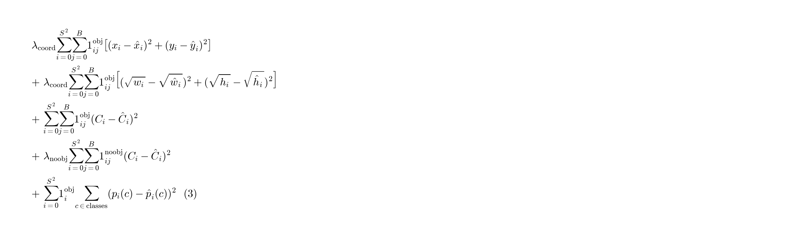

# 译本公式排版约定

后续 YOLO 论文中文译本统一采用**论文风格公式图**，不再使用单行纯文本公式。

## 规范

1. 用脚本把 LaTeX 渲染成 PNG，放入 `docs/yolo-survey/figures/<version>/`
2. Markdown 中用图片引用：

```markdown

```

3. 复杂损失优先排成**多行对齐**（与原文一致），必要时另附分项展开图
4. 避免在正文使用 `$...$` / `$$...$$` 作为主展示（GitHub diff 不渲染）

## 文件命名建议

- `eq_confidence.png`
- `eq1_xxx.png`
- `eq2_xxx.png`
- `eq3_loss.png`
- `eq3_loss_split.png`
