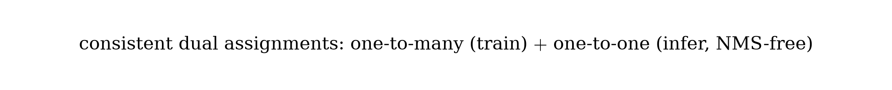

# YOLOv10：实时端到端目标检测（中文译本）

> 原文：*YOLOv10: Real-Time End-to-End Object Detection*  
> 作者：Ao Wang, Hui Chen, Lihao Liu, Kai Chen, Zijia Lin, Jungong Han, Guiguang Ding（清华大学等）  
> 来源：[arXiv:2405.14458](https://arxiv.org/abs/2405.14458) / NeurIPS 2024  
> 代码：https://github.com/THU-MIG/yolov10  
> 说明：论文式中文整理译本；公式以图片嵌入。

---

## 摘要

YOLO 依赖 **NMS** 后处理，阻碍真正端到端部署并增加延迟方差；同时各组件缺乏系统审视，存在冗余、限制能力。本文从后处理与架构两侧推进：

1. **Consistent dual assignments**：NMS-free 训练，兼顾性能与低延迟；  
2. **Holistic efficiency-accuracy driven design**：全面优化分类头、下采样、块设计、大核卷积与部分自注意力。

得到 **YOLOv10-N/S/M/B/L/X**。例：YOLOv10-S 在相近 AP 下比 RT-DETR-R18 快约 **1.8×**，参数/FLOPs 约 **2.8×** 更小；相对 YOLOv9-C，YOLOv10-B 延迟约 **-46%**、参数约 **-25%**。

---

## 1. 引言

YOLO 管线 = 前向 + NMS。一对多标签分配带来强监督，却迫使推理做 NMS。端到端路线有 DETR 系（部署复杂）与 CNN 一对一匹配（常掉点或加开销）。

架构侧：骨干（DarkNet/CSP/ELAN…）、颈部（PAN/RepGFPN…）、缩放与重参数化已很多，但仍缺对冗余与能力的整体体检。

YOLOv10 同时解决：**去 NMS** + **整体重设计**。

---

## 2. 方法

### 2.1 Consistent Dual Assignments（NMS-free）

  

- 训练：保留 **one-to-many** 头提供丰富监督；另加结构相同的 **one-to-one** 头。  
- 推理：丢弃 one-to-many，只用 one-to-one → **无需 NMS**，无额外推理成本。  
- 一对一匹配用 top-1 选择，性能接近匈牙利匹配、训练更省。

匹配度量统一为：

  

其中 \(p\) 为分类分，IoU 为框重合，\(s\) 为空间先验；\(\alpha,\beta\) 平衡语义与定位。

**Consistent matching**：令 \(\alpha_{o2o}=\alpha_{o2m}\)、\(\beta_{o2o}=\beta_{o2m}\)（默认 \(r=1\)），使两头“最佳正样本”对齐，缩小监督鸿沟，提升一对一头质量。

### 2.2 效率—精度驱动的整体设计

  

#### 效率侧

1. **轻量分类头**：回归头对 YOLO 更关键；分类头改为两层 DWConv + 1×1，显著降开销。  
2. **空间—通道解耦下采样**：先 1×1 调通道，再 DWConv stride=2 降分辨率，降低算力并更好保信息。  
3. **Rank-guided block**：用内在秩分析各 stage 冗余；冗余深 stage 换 **CIB（compact inverted block）**，自适应紧凑化。

#### 精度侧

1. **大核 DWConv**：在深 stage 的 CIB 中把核扩到 7×7，并用重参数化辅助优化；主要用于小规模模型。  
2. **PSA（Partial Self-Attention）**：通道对半分，仅一半走 MHSA+FFN，再融合；只放最低分辨率 Stage4，引入全局建模且控制成本。

---

## 3. 实验（摘要）

COCO val，端到端延迟（含后处理考量；论文 Table 1）：

| 模型 | 参数 | FLOPs | APval | Latency (ms) |
|------|------|-------|------------------|--------------|
| YOLOv10-N | 2.3M | 6.7G | 38.5（†39.5 含 NMS 一对多） | 1.84 |
| YOLOv10-S | 7.2M | 21.6G | 46.3（†46.8） | 2.49 |
| YOLOv10-M | 15.4M | 59.1G | 51.1（†51.3） | 4.74 |
| YOLOv10-B | 19.1M | 92.0G | 52.5 | 5.74 |
| YOLOv10-L | 24.4M | 120.3G | 53.2 | 7.28 |
| YOLOv10-X | 29.5M | 160.4G | 54.4 | 10.70 |

相对 YOLOv8-L/X：更高或持平 AP，参数约 **1.8× / 2.3×** 更少。相对 YOLOv9-M / YOLO-MS：相近 AP，参数约 **-23% / -31%**。

---

## 4. 结论

YOLOv10 用 **一致双分配** 去掉推理 NMS，并用 **效率—精度整体设计**（轻量分类头、解耦下采样、CIB、大核、PSA）压冗余、提能力，把 YOLO 推到更真正的实时端到端形态。

---

## 译本说明

† 表示仍用原始一对多 + NMS 的对照结果。部署时默认走一对一头、NMS-free。
