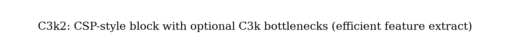

# YOLO11：中文译本（基于官方实现与架构说明）

**状态说明（重要）：**  
YOLO11 **没有**由 Ultralytics 发布的正式同行评审论文。官方以文档与代码为准：

- 代码：https://github.com/ultralytics/ultralytics  
- 文档：https://docs.ultralytics.com/models/yolo11/  
- 架构指南：https://docs.ultralytics.com/guides/yolo-architecture/  
- 发布：Ultralytics，**2024-09-10**

> 本译本为依据官方文档 / 配置的工程向整理，不是单一论文逐句翻译。公式图见 `figures/yolov11/`。  
> 注：Ultralytics 后续主力部署线已推 **YOLO26**（NMS-free 等）；YOLO11 仍作为稳定、成熟的多任务基线被广泛使用。

---

## 1. 概述

YOLO11 在 YOLOv8 工程体系上继续强化特征提取与效率，目标是：**更高 mAP、更少参数、更快处理**，并保持 detect / seg / pose / obb / cls 多任务统一接口。

官方强调：YOLO11m 在 COCO 上相对 YOLOv8m 约 **少 22% 参数** 且 mAP 更高。

---

## 2. 总体架构

<p align="center">
  
</p>

相对 YOLOv8 的关键结构变化（官方架构指南）：

| 组件 | YOLOv8 | YOLO11 |
|------|--------|--------|
| 骨干/颈块 | C2f | **C3k2** |
| 注意力 | 无专用 | **C2PSA**（partial spatial attention） |
| 空间池化 | SPPF | SPPF（保留） |
| 检测头 | anchor-free + DFL | 同范式，头部更轻量（深度可分离等） |

### 2.1 C3k2

<p align="center">
  
</p>

C3k2 可视为 GELAN / CSP 思路下的高效规格：可选 C3k bottleneck，在精度与延迟间更紧。相对 C2f，官方定位为更高效的特征提取单元。

### 2.2 C2PSA

在骨干末端等位置引入 **Convolutional block with Partial Spatial Attention**，增强小目标与遮挡场景的空间聚焦，同时控制开销。

### 2.3 Head

延续 **anchor-free 解耦头 + DFL（reg_max=16）**；分类分支进一步轻量化（深度可分离卷积），与 YOLOv10 效率思路同向但保持 Ultralytics 多任务产品化路径（默认仍依赖 NMS，而非 v10 式双头 NMS-free）。

---

## 3. 性能（COCO Detect，官方文档）

| 模型 | mAP<sup>val</sup> 50-95 | CPU ONNX (ms) | T4 TensorRT10 (ms) | 参数 (M) | FLOPs (B) |
|------|-------------------------|---------------|--------------------|----------|-----------|
| YOLO11n | 39.5 | 56.1 | 1.5 | 2.6 | 6.5 |
| YOLO11s | 47.0 | 90.0 | 2.5 | 9.4 | 21.5 |
| YOLO11m | 51.5 | 183.2 | 4.7 | 20.1 | 68.0 |
| YOLO11l | 53.4 | 238.6 | 6.2 | 25.3 | 86.9 |
| YOLO11x | 54.7 | 462.8 | 11.3 | 56.9 | 194.9 |

---

## 4. 多任务与用法

权重命名：`yolo11n.pt` … `yolo11x.pt`，以及 `-seg` / `-pose` / `-obb` / `-cls`。

```python
from ultralytics import YOLO

model = YOLO("yolo11n.pt")
model.train(data="coco8.yaml", epochs=100, imgsz=640)
results = model("path/to/bus.jpg")
```

---

## 5. 在系列中的位置

- **相对 v8**：C3k2 + C2PSA，参数更省、精度更高。  
- **相对 v9/v10**：v9 重 PGI/GELAN 训练与骨干理论；v10 重 NMS-free 端到端；YOLO11 是 Ultralytics 官方多任务稳定版。  
- **相对 v12/v13**：社区注意力/超图路线；Ultralytics 曾提示 YOLO12/13 生产慎用，YOLO11 更偏工程稳妥。

---

## 6. 引用（官方建议）

```bibtex
@software{yolo11_ultralytics,
  author = {Glenn Jocher and Jing Qiu},
  title = {Ultralytics YOLO11},
  version = {11.0.0},
  year = {2024},
  url = {https://github.com/ultralytics/ultralytics},
  license = {AGPL-3.0}
}
```

---

## 译本说明

无正式论文；模块名以 `ultralytics/cfg/models` 与官方架构文档为准。
