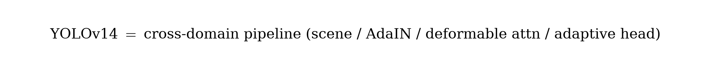
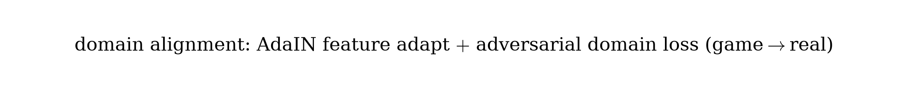

# YOLOv14：统一跨域实时目标检测（中文译本）

**状态说明（重要）：**  
YOLOv14（南京邮电大学张晨斌团队等开源）**尚无正式 arXiv / 同行评审论文**（仓库 Citation 标注 *In preparation*）。本译本依据公开 **GitHub README 与代码结构**整理，属于工程/技术报告向译本，学术引用需谨慎。

- 代码：https://github.com/zhangcbb/yolov14  
- 许可证：AGPL-3.0  
- 定位：面向**非理想成像**的跨域实时检测，而非单纯刷 COCO 小数点

公式图见 `figures/yolov14/`。

---

## 1. 概述

传统 YOLO（含 v13）默认输入接近**理想针孔相机**真实照片。真实世界大量失败案例来自：

| 场景 | 标准检测器问题 | YOLOv14 思路 |
|------|----------------|--------------|
| 鱼眼 / 广角 | 边缘目标易漏 | 可变形区域注意力扭曲采样网格 |
| 游戏角色 | 难以当成 “person” | Game2Real 域自适应 |
| 无人机俯视 | 小目标弱 | 多视角条件 + 动态尺度路由 |
| 360° 全景 | 边界断裂、纬度畸变 | 球形注意力 + 循环卷积 |
| 混合相机源 | 单模型难通吃 | 自适应增强按场景分流 |

核心哲学：学习 **域不变、视角鲁棒** 特征（可变形注意力 + AdaIN + 对抗域对齐）。

---

## 2. 系统管线（六阶段）

<p align="center">
  
</p>

1. **Scene Analysis**：轻量启发式判断场景类型（game / fisheye / drone / panorama / standard）。  
2. **Adaptive Augmentation**（仅训练）：按场景路由增强（游戏风格化、鱼眼畸变、透视变换、域 mixup）。  
3. **Domain Adaptation**：AdaIN 对齐特征统计 + 域对抗损失。  
4. **Multi-View Conditioning**：注入 6 类视角嵌入。  
5. **Deformable Feature Pyramid**：可变形区域注意力 + DynamicScaleRouter。  
6. **Detection Heads**：解耦 P3/P4/P5 + 自适应 NMS。

结构示意：

```text
Input → Scene Analysis → DomainAdaptiveLayer → ViewEmbedding →
DeformableA2C2f (×N) → DynamicScaleRouter → Detect(P3/P4/P5)
```

---

## 3. 关键模块

### 3.1 域自适应（Game2Real）

<p align="center">
  
</p>

三重机制：

- **数据级**：`GameCharacterStylization`（色调、锐化、对比等模拟渲染风格）；  
- **特征级**：`DomainAdaptiveLayer`（AdaIN 把游戏域统计拉向真实域）；  
- **目标级**：`DomainAdversarialLoss`（梯度反转，特征对域分类器对抗）。

### 3.2 多视角 / 全景

<p align="center">
  
</p>

- **ViewEmbedding**：pinhole / fisheye / panoramic / drone / BEV / ground 共 6 类，concat + 1×1 注入；  
- **CrossViewConsistencyLoss**：NT-Xent，拉近同语义跨视角特征；  
- **SphereAAttn**：按纬度带做球形感知注意力；  
- **CircularConv**：水平环绕 padding，保持 0°/360° 连续。

### 3.3 可变形区域注意力与尺度路由

- `DeformableConv` / `DeformableAAttn` / `DeformableA2C2f`：在变形网格上算区域注意力，适应几何畸变；  
- `DynamicScaleRouter`：学习 P3/P4/P5 权重（无人机偏 P3 小目标等）。

---

## 4. 模型变体

| 变体 | 关键模块 | 目标场景 |
|------|----------|----------|
| Standard | A2C2f | 普通针孔图 |
| Deformable | DeformableA2C2f | 鱼眼 / 广角 |
| MultiView | ViewEmbedding + CrossViewLoss | 无人机 / BEV / 混合视角 |
| Panorama | SphereAAttn + CircularConv | 360° 等距柱状投影 |
| Game2Real | DomainAdaptiveLayer + DomainAdvLoss | 游戏角色检测 |
| Adaptive | 全部组合 | 通用（自动场景分析） |

配置位于 `ultralytics/cfg/models/v14/`（如 `yolov14-adaptive.yaml`）。

---

## 5. 与前代差异（设计哲学）

| 方面 | 既往 YOLO | YOLOv14 |
|------|-----------|---------|
| 输入假设 | 理想针孔 | 任意相机 / 渲染引擎 |
| 域 | 单域真实照片 | 跨域（game→real） |
| 视角 | 地面前向 | 任意（无人机、BEV、360°） |
| 增强 | 固定统一 | 按场景自适应 |
| 注意力 | 规则网格区域注意力 | 可变形采样位置 |

---

## 6. 实验与指标说明

公开 README **未给出完整 COCO mAP / 参数量表**；论文预印本标注筹备中。评估重点预期在：鱼眼、游戏截图、无人机、全景等跨域基准，而非仅 COCO val。

使用示例（仓库）：

```python
from ultralytics import YOLO
model = YOLO("ultralytics/cfg/models/v14/yolov14-adaptive.yaml")
model.train(data="coco.yaml", epochs=300, imgsz=640)
```

---

## 7. 结论

YOLOv14 把 YOLO 叙事从「标准成像上的精度—速度」扩展到 **非理想成像的统一跨域框架**：场景分析、自适应增强、域对齐、多视角条件、可变形金字塔与自适应头组成完整管线。精读时需区分：**社区跨域开源线** vs Ultralytics 官方主线（YOLO11 / YOLO26）。

---

## 译本说明

- 无正式论文；模块与管线以 https://github.com/zhangcbb/yolov14 README 为准。  
- 论文发布后应回填作者、实验表与公式细节。
