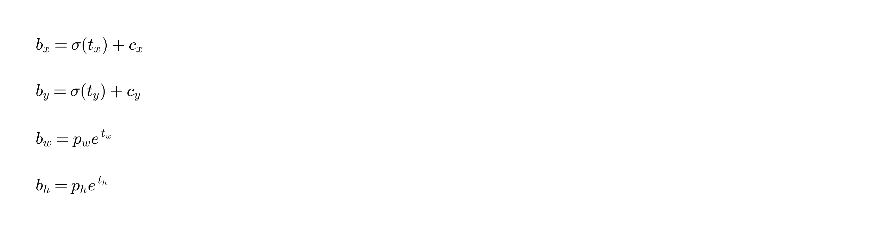
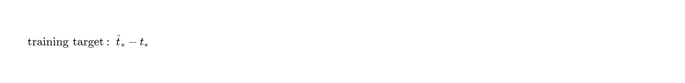
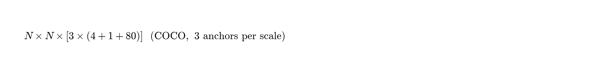

# YOLOv3：一次渐进式改进

**原文：** YOLOv3: An Incremental Improvement  
**作者：** Joseph Redmon, Ali Farhadi（University of Washington）  
**原文链接：** https://arxiv.org/abs/1804.02767  
**项目：** https://pjreddie.com/yolo/

> 说明：本文为调研用中文译本。公式以论文风格图片呈现（`figures/yolov3/`）。原文为技术报告风格，语气较随意，译文保留其技术内容。

---

## 摘要

我们对 YOLO 做了一系列更新：若干小改动能提升效果，并训练了更好的新网络。网络比上一代更大，也更准，但仍然很快。在 320×320 输入下，YOLOv3 约 22 ms、28.2 mAP，精度与 SSD 相近且约快 3 倍。若看旧指标 AP50（IoU=0.5），YOLOv3 在 Titan X 上约 51 ms 达到 57.9 AP50；RetinaNet 约 198 ms 达到 57.5 AP50——相近精度下约快 3.8 倍。代码见：https://pjreddie.com/yolo/。

---

## 1 引言

本文是一份技术报告，用于沉淀对 YOLO 的若干增量改进：先说明 YOLOv3 是什么，再给结果，然后记录一些**没成功**的尝试，最后略作讨论。

---

## 2 The Deal（系统说明）

YOLOv3 大量吸收已有好想法，并训练了更强的分类骨干。下面从头梳理整套系统。

**图 1：** 速度–精度对比（改编自 Focal Loss 论文）。YOLOv3 在相近精度下明显更快。

### 2.1 边界框预测

沿用 YOLO9000：用维度聚类得到的先验作 anchor。每个框预测 4 个坐标 t_x,t_y,t_w,t_h。若格子相对图像左上角偏移为 (c_x,c_y)，先验宽高为 p_w,p_h，则：

训练使用平方和误差。若某坐标真值为 hatt_*，梯度目标为：

真值可由上式反解得到。

**图 2：** 维度先验与位置预测（与 YOLO9000 图类似）。

每个框用 logistic 回归预测 **objectness**：若某先验与某 GT 的重叠超过其他先验，则该先验 objectness 目标为 1。若不是最好、但 IoU 超过阈值（文中用 0.5），则忽略该预测（参考 Faster R-CNN 思路）。与 Faster R-CNN 不同：每个 GT **只分配一个**先验。未被分配的先验不对坐标/分类计损失，只对 objectness 计损失。

### 2.2 类别预测

每个框用**多标签分类**预测可能包含的类别。不用 softmax，而用独立的 logistic 分类器；训练用二元交叉熵。

这在 Open Images 等存在重叠标签（如 Woman 与 Person）的数据上更合理：softmax 假设每框恰好一类，多标签更贴合真实标注。

### 2.3 跨尺度预测

YOLOv3 在 **3 个尺度**预测框，特征融合思想类似 **FPN**。在骨干后加若干卷积，最后一层输出三维张量，编码框、objectness 与类别。COCO 实验中每尺度 3 个框，张量为：

其中 4 为框偏移，1 为 objectness，80 为类别。

接着取更早两层的特征图上采样 2 倍，与更早层特征拼接，再卷积并预测下一尺度（分辨率更大）。再重复一次得到第三尺度。第三尺度因而同时受益于深层语义与浅层细粒度特征。

先验仍用 k-means。文中任意取 9 个簇、3 个尺度，并均分到各尺度。COCO 上 9 个簇为：

`(10×13), (16×30), (33×23), (30×61), (62×45), (59×119), (116×90), (156×198), (373×326)`

### 2.4 特征提取器：Darknet-53

新骨干是 Darknet-19 与残差网络的混合：连续 3×3 / 1×1 卷积，并加入 shortcut，规模更大，共 **53** 个卷积层，故称 **Darknet-53**。

**表 2：骨干对比**（ImageNet，256×256，Titan X）

| Backbone | Top-1 | Top-5 | Bn Ops | BFLOP/s | FPS |
|---|---:|---:|---:|---:|---:|
| Darknet-19 | 74.1 | 91.8 | 7.29 | 1246 | 171 |
| ResNet-101 | 77.1 | 93.7 | 19.7 | 1039 | 53 |
| ResNet-152 | 77.6 | 93.8 | 29.4 | 1090 | 37 |
| **Darknet-53** | **77.2** | **93.8** | **18.7** | **1457** | **78** |

Darknet-53 精度接近 ResNet-101/152，但更快（约 1.5× / 2×），且测得的 BFLOP/s 更高，GPU 利用率更好。

### 2.5 训练

仍在整图上训练，不用 hard negative mining。使用多尺度训练、大量增广、BN 等常规技巧；框架为 Darknet。

---

## 3 效果如何

**表 3：COCO 对比（部分）**

| 方法 | backbone | AP | AP50 | AP75 | APS | APM | APL |
|---|---|---:|---:|---:|---:|---:|---:|
| Faster R-CNN w FPN | ResNet-101-FPN | 36.2 | 59.1 | 39.0 | 18.2 | 39.0 | 48.2 |
| YOLOv2 | Darknet-19 | 21.6 | 44.0 | 19.2 | 5.0 | 22.4 | 35.5 |
| SSD513 | ResNet-101 | 31.2 | 50.4 | 33.3 | 10.2 | 34.5 | 49.8 |
| RetinaNet | ResNet-101-FPN | 39.1 | 59.1 | 42.3 | 21.8 | 42.7 | 50.2 |
| **YOLOv3 608** | **Darknet-53** | **33.0** | **57.9** | **34.4** | **18.3** | **35.4** | **41.9** |

要点：
- 在 COCO AP@[.5:.95] 上与 SSD 变体相当，约快 3×，仍落后 RetinaNet。
- 在 **AP50** 上很强，接近 RetinaNet、远超 SSD——说明“框大致对”做得好；随 IoU 阈值升高掉点明显——**精定位仍弱**。
- 多尺度后 **小目标 APS** 明显好于旧 YOLO；中大目标相对不占优。

摘要数据：320×320 约 22 ms / 28.2 mAP；AP50 对比 RetinaNet 约 3.8× 更快。

---

## 4 试过但没用的东西

- **普通 anchor 式线性 x,y 偏移**（相对宽高倍数）：更不稳、效果差。  
- **线性激活直接预测 x,y**（不用 logistic）：掉几个点。  
- **Focal loss**：掉约 2 点。作者猜测 YOLOv3 已有独立 objectness + 条件类别，对 focal 要解决的不平衡可能已较鲁棒。  
- **双 IoU 阈值正负样本分配**（类 Faster R-CNN）：未调出好结果。

作者认为当前配方至少处于局部最优。

---

## 5 这意味着什么

YOLOv3：快、准（尤其 AP50）。在 COCO 严格 AP 上不如顶尖模型。作者并讨论了评价指标与社会影响等（译文从略技术外评议）。

另注：文中提到还修了 YOLOv2 数据加载 bug，大约贡献 2 mAP。

---

## 附录：核心公式

---

## 参考文献（节选）

[5] He et al. ResNet. CVPR 2016.  
[8] Lin et al. FPN. CVPR 2017.  
[9] Lin et al. Focal Loss / RetinaNet. 2017.  
[10] Lin et al. COCO. ECCV 2014.  
[15] Redmon & Farhadi. YOLO9000. CVPR 2017.  
[17] Ren et al. Faster R-CNN. 2015.
