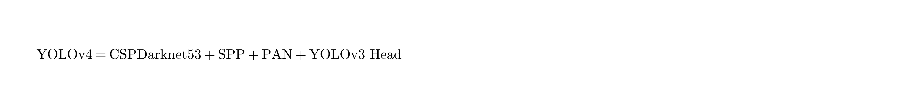
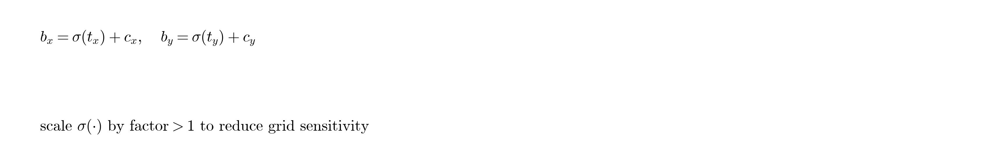

# YOLOv4：目标检测的最优速度与精度

**原文：** YOLOv4: Optimal Speed and Accuracy of Object Detection  
**作者：** Alexey Bochkovskiy；Chien-Yao Wang, Hong-Yuan Mark Liao（Academia Sinica）  
**原文链接：** https://arxiv.org/abs/2004.10934  
**代码：** https://github.com/AlexeyAB/darknet  

> 说明：调研用中文译本。公式/架构式以图片呈现（`figures/yolov4/`）。YOLOv4 由 Redmon 体系外的团队接续；强调单卡可训、生产可用的实时检测。

---

## 摘要

CNN 精度提升技巧极多，需要在大数据集上系统组合验证。有些技巧只适用于特定模型/任务/小数据；而 BN、残差连接等更具通用性。作者认为较通用的方向还包括：WRC、CSP、CmBN、SAT、Mish 等。YOLOv4 组合使用 WRC、CSP、CmBN、SAT、Mish、Mosaic 增广、DropBlock、CIoU 损失等，在 MS COCO 上达到 **43.5% AP（65.7% AP50）**，Tesla V100 上约 **65 FPS** 实时。代码：https://github.com/AlexeyAB/darknet。

---

## 1 引言

多数 CNN 检测器要么慢而准（推荐系统），要么快而不够准（碰撞预警等）。提升实时检测精度，才能把检测用于更独立的流程控制。目标是：在**常规 GPU**上实时跑、且**单卡即可训练**。

**贡献：**
1. 高效强力的检测模型，1080 Ti / 2080 Ti 即可训出又快又准的检测器；  
2. 系统验证目标检测中的 Bag-of-Freebies（BoF）与 Bag-of-Specials（BoS）；  
3. 改造若干 SOTA 方法，使其更适合单卡训练（如改 CBN、PAN、SAM 等）。

相对 YOLOv3，文称 AP 与 FPS 约分别提升约 10% 与 12%。

**图 1：** YOLOv4 与其他检测器对比；约比 EfficientDet 快一倍且精度可比。

---

## 2 相关工作

### 2.1 检测器结构

现代检测器通常含：
- **Backbone**（ImageNet 预训练）
- **Neck**（跨尺度特征聚合：FPN / PAN / BiFPN …）
- **Head**（一阶段密集预测 / 二阶段稀疏预测；anchor-based 或 anchor-free）

一阶段代表：YOLO、SSD、RetinaNet；二阶段：Faster R-CNN 等。

### 2.2 Bag of Freebies（BoF）

只改训练策略或增加训练代价、**不增加推理代价**的技巧：
- 数据增广：光度/几何变换；CutOut、MixUp、CutMix；风格迁移等  
- 类别不平衡：两阶段常用困难样本挖掘；一阶段可用 Focal Loss  
- Label smoothing  
- 框回归损失：从 MSE → IoU / GIoU / DIoU / **CIoU**（重叠 + 中心距 + 长宽比）

### 2.3 Bag of Specials（BoS）

少量增加推理成本、显著提点的插件/后处理：
- 感受野：SPP、ASPP、RFB  
- 注意力：SE、SAM  
- 特征融合：SFAM、ASFF、BiFPN  
- 激活：Mish、Swish 等  
- 后处理：NMS / soft-NMS / DIoU-NMS  

文中回顾：改进版 SPP（多尺度 max-pool 拼接）给 YOLOv3-608 约 +2.7 AP50，仅约 +0.5% 算力。

---

## 3 方法

设计原则：优先**生产速度与并行效率**，而非单纯追求更低理论 BFLOPs。

### 3.1 架构选择

分类最优骨干未必检测最优。检测更需要：更高输入分辨率、更大感受野、更大容量。

对比 CSPResNeXt50 与 CSPDarknet53：前者分类常更好，但 **CSPDarknet53 检测更好**（更多 3×3 层、更大感受野与参数量）。最终选择：

- Backbone：**CSPDarknet53**  
- 额外模块：**SPP**（扩大感受野，几乎不降速）  
- Neck：**PANet**（替代 YOLOv3 的 FPN）  
- Head：**YOLOv3（anchor-based）头**

不使用跨 GPU SyncBN，保证单卡可复现。

### 3.2 BoF / BoS 选型思路

激活候选去掉难训或不适用的 PReLU/SELU/ReLU6；正则选用 **DropBlock**；单卡训练不考虑 SyncBN。

### 3.3 额外改进（适配单卡）

1. **Mosaic 数据增广**：拼接 4 张训练图（CutMix 只混 2 张），丰富上下文；BN 统计来自 4 图，降低对大 batch 的依赖。  
2. **Self-Adversarial Training (SAT)**：两阶段——先改图像让网络“骗自己看不到物体”，再在修改图上正常训练检测。  
3. 遗传算法搜超参。  
4. 改造：CmBN（Cross mini-Batch Normalization）、改 SAM（点式注意力）、改 PAN（shortcut 改拼接）。

**图 3–6：** Mosaic、CmBN、改 SAM、改 PAN 示意。

### 3.4 YOLOv4 组成清单

**YOLOv4 =**
- Backbone: CSPDarknet53  
- Neck: SPP + PAN  
- Head: YOLOv3  

**BoF for backbone：** CutMix、Mosaic、DropBlock、Label smoothing  

**BoS for backbone：** Mish、CSP、MiWRC  

**BoF for detector：** CIoU loss、CmBN、DropBlock、Mosaic、SAT、消除网格敏感性、一 GT 多 anchor、余弦退火、最优超参、随机训练形状等  

**BoS for detector：** Mish、SPP、SAM、PAN、DIoU-NMS  

消除网格敏感性：YOLOv3 中

因 c_x,c_y 为整数，要使 b_x 贴近格子边界需要极大 |t_x|。YOLOv4 将 sigmoid 输出乘以 **>1 的因子**，减轻该问题。

---

## 4 实验

### 4.1 设置

- ImageNet 分类：验证增广与激活等  
- MS COCO 检测：单卡多尺度训练；batch 64，mini-batch 4 或 8  

### 4.2 分类器上的 BoF / Mish

CutMix、Mosaic、Label smoothing、Mish 可提升分类精度（见表 2/3）。BoF-backbone 选定：CutMix + Mosaic + Label smoothing；Mish 作为补充。

### 4.3 检测器上的 BoF / BoS

BoF 消融（表 4）验证：消除网格敏感性、Mosaic、IoU 阈值、遗传算法超参、Label smoothing、CmBN、余弦退火、动态 mini-batch、优化 anchor、以及 GIoU/DIoU/**CIoU** 等。组合后 AP 可从约 38% 提到 **42%+**。

BoS（表 5）：**SPP + PAN + SAM** 表现最好。

### 4.4 骨干与预训练权重

CSPResNeXt50 分类更强，但 **CSPDarknet53 + BoF + Mish** 做检测更好（表 6，约 **43.0 AP** @512）。再次说明：分类冠军 ≠ 检测冠军。

### 4.5 mini-batch 大小

引入 BoF/BoS 后，mini-batch 4 与 8 差距很小（表 7）——降低对昂贵大显存多卡的依赖。

---

## 5 结果

YOLOv4 落在速度–精度 Pareto 前沿。

**COCO test-dev 关键数字（YOLOv4, CSPDarknet-53）：**

| 输入 | AP | AP50 | AP75 | APS | 备注 |
|---:|---:|---:|---:|---:|---|
| 416 | 41.2 | 62.8 | 44.3 | 20.4 | V100 约 96 FPS |
| 512 | 43.0 | 64.9 | 46.5 | 24.3 | V100 约 83 FPS |
| **608** | **43.5** | **65.7** | **47.3** | **26.7** | V100 约 62 FPS |

对比：YOLOv3-608 约 33.0 AP / 57.9 AP50；YOLOv3-SPP-608 约 36.2 AP。YOLOv4 在实时区间整体更强。

（Maxwell/Pascal/Volta 多表详见原文 Table 8–10。）

---

## 6 结论

YOLOv4 提供可在常规 GPU（约 8–16GB）上训练与部署的 SOTA 级实时检测器，证明一阶段 anchor-based 路线仍有生命力，并沉淀了大量可复用的 BoF/BoS 最佳实践。

致谢中提到 Mosaic、遗传算法超参、网格敏感性等问题部分来自 Glenn Jocher（Ultralytics / YOLOv3 PyTorch）的想法。

---

## 附录：架构速记

---

## 参考文献（节选）

[25] He et al. SPP. TPAMI 2015.  
[45] Lin et al. Focal Loss. ICCV 2017.  
[49] Liu et al. Path Aggregation Network (PANet).  
[63] Redmon & Farhadi. YOLOv3. 2018.  
[65] Rezatofighi et al. GIoU.  
[81] Wang et al. CSPNet.  
[99] Zheng et al. DIoU / CIoU.
