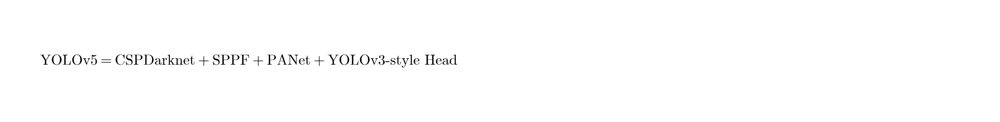
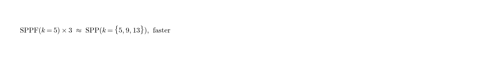

# YOLOv5：中文译本（基于官方实现与架构说明）

**状态说明（重要）：**  
YOLOv5 **没有**由 Ultralytics 发布的正式同行评审论文。它以开源仓库与文档为主：

- 代码：https://github.com/ultralytics/yolov5  
- 文档：https://docs.ultralytics.com/models/yolov5/  
- 架构说明：https://docs.ultralytics.com/yolov5/tutorials/architecture_description/  
- 发布：Ultralytics / Glenn Jocher，2020 年公开（在 YOLOv4 之后）

> 本译本依据官方文档、仓库说明及后续梳理文献整理，属于**工程实现导向的技术译本**，不是某篇单一论文的逐句翻译。公式图见 `figures/yolov5/`。

---

## 1 概述

YOLOv5 是 Ultralytics 在 **PyTorch** 上打造的实时目标检测框架，目标是在保持 YOLO 系速度的同时，大幅降低训练、导出与部署门槛。它继承 YOLOv3/v4 的一阶段、anchor-based、多尺度检测思想，但把重心放在：

- 可复现的工程实现  
- 模型缩放家族（n/s/m/l/x）  
- 数据增广、自动锚框、导出（ONNX/TensorRT 等）一体化  

社区中常把它看作 “YOLOv4 同期、偏工程与易用性的 PyTorch 版本线”。

---

## 2 发展脉络（仓库时间线摘要）

- **2020-04**：基于 YOLOv3/v4 思路启动复合缩放的 PyTorch 模型开发  
- **2020-05-27**：公开 YOLOv5 仓库  
- **2020-06-09**：引入 CSP 模块（速度/体积/精度）  
- **2020-06-19**：默认 FP16，检查点更小、推理更快  
- **2020-06-22**：PANet 更新、检测头调整、参数更少、mAP 提升  

早期命名曾与 “v4” 混淆，后统一为 **YOLOv5**，以免与 Darknet 版 YOLOv4 冲突。

---

## 3 总体架构

与现代 YOLO 一致，分为三部分：

### 3.1 Backbone（骨干）

采用 **CSPDarknet** 风格骨干（CSP：Cross Stage Partial）：
- 特征图分成两部分，分别处理后合并，减少重复梯度计算  
- 在精度接近的前提下降低算力与体积  
- 早期版本曾用 Focus 切片模块；后续常用 **6×6 Conv** 替代 Focus 以提效  

主干由多层 **CBS**（Conv + BatchNorm + SiLU）与 **C3/CSP bottleneck** 堆叠构成，末端接空间金字塔池化模块。

### 3.2 Neck（颈部）

- **SPPF**（Spatial Pyramid Pooling – Fast）：用串行的 `k=5` max-pool 近似原 SPP 的多核池化  

- **PANet（Path Aggregation Network）**：在 FPN 自上而下融合之外，再增加自下而上路径，增强定位信息回传  

相对 YOLOv3“几乎只有 FPN 式自顶向下”，YOLOv5 的 PAN 底向上路径是重要结构差异之一。

### 3.3 Head（检测头）

沿用 **YOLOv3 风格的 anchor-based 多尺度头**：
- 通常在三个特征尺度上预测（约对应小/中/大目标）  
- 每个尺度多个 anchor，输出框偏移、objectness、类别  

（后续 Ultralytics 生态中也有 anchor-free 的 `u` 变体配置，但经典 YOLOv5 检测以 anchor-based 为主。）

---

## 4 训练方法与工程要点

### 4.1 数据增广

强增广是 YOLOv5 表现的关键来源之一，常见包括：
- Mosaic（四图拼接，思想与 YOLOv4 同源）  
- 随机缩放、翻转、色域扰动等  
- 多尺度训练：输入尺寸在一定范围内随机变化  

### 4.2 AutoAnchor

根据自定义数据集 GT 框分布，用聚类 + 遗传算法等自动优化先验 anchor，使预设框更贴合数据，而不是死用 COCO 默认锚。

### 4.3 优化与稳定训练

常见实践：
- Warmup + 余弦学习率调度  
- EMA（指数滑动平均权重）稳定泛化  
- 混合精度（AMP）降显存、提速  
- 损失：框回归（常与 IoU 系损失相关）+ 分类 + objectness；正负样本按网格/anchor 匹配规则分配  

### 4.4 模型缩放

提供复合缩放系列：

| 变体 | 定位 |
|---|---|
| YOLOv5n | 最快最轻，边缘侧 |
| YOLOv5s | 速度与精度均衡（常用基线） |
| YOLOv5m/l | 更高精度 |
| YOLOv5x | 最大最准（更慢） |

同一套结构通过宽度/深度系数扩展，便于按硬件选型。

### 4.5 部署友好

原生支持多种导出与推理路径（ONNX、TensorRT、CoreML、TFLite 等），这是相对早期 Darknet YOLO 的主要工程优势。

---

## 5 与 YOLOv3 / YOLOv4 的关系（调研用对照）

| 维度 | YOLOv3 | YOLOv4 | YOLOv5 |
|---|---|---|---|
| 发布形态 | 技术报告 + Darknet | 论文 + Darknet | **无正式论文** + PyTorch 仓库 |
| 骨干 | Darknet-53 | CSPDarknet53 | CSPDarknet（工程化实现） |
| Neck | FPN 式 | SPP + PAN | **SPPF + PANet** |
| Head | Anchor，3 尺度 | YOLOv3 头 | YOLOv3 风格头 |
| 训练亮点 | 多尺度、logistic 多标签 | Mosaic/SAT/CIoU/Mish 等 BoF/BoS | Mosaic、AutoAnchor、EMA、AMP、易用 API |
| 核心价值 | 多尺度小目标跃迁 | 单卡可训的精度–速度 Pareto | **工程落地与生态** |

一句话：

> YOLOv3 定下多尺度检测骨架；YOLOv4 系统堆训练与模块技巧冲 COCO；YOLOv5 把同类思想做成最易用的 PyTorch 生产线。

---

## 6 性能与使用注意

- 官方与社区报告的 COCO 数字随版本（v5.0→v6.x→v7.x）持续变化，引用时务必标注 **仓库版本/模型权重日期**。  
- 横向对比时不要把 “YOLOv5s” 与 “YOLOv4-608” 不同输入、不同后处理直接硬比。  
- 调研写作建议表述为：**“Ultralytics YOLOv5（开源实现，无正式论文）”**。

---

## 7 小结

YOLOv5 的“文献意义”主要不在提出全新检测数学框架，而在于：

1. 把 CSP + PAN/SPP(F) + YOLO 头固化为可广泛复现的 PyTorch 基线；  
2. 用 AutoAnchor、强增广、EMA、导出工具链降低工业落地成本；  
3. 用 n/s/m/l/x 缩放覆盖边缘到服务器场景。  

对你的调研表：v5 应单列“无正式论文 / 以官方仓库与文档为准”，改进点写 **工程化、CSP/SPPF/PANet、AutoAnchor、易部署**。

---

## 参考来源

1. Ultralytics YOLOv5 GitHub: https://github.com/ultralytics/yolov5  
2. Ultralytics Docs – YOLOv5: https://docs.ultralytics.com/models/yolov5/  
3. Ultralytics Docs – Architecture description  
4. Khanam & Hussain, *What is YOLOv5…*, arXiv:2407.20892（第三方梳理，非官方原论文）
