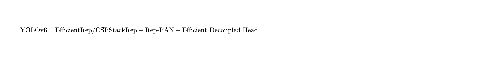
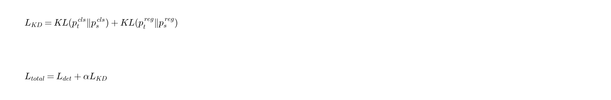
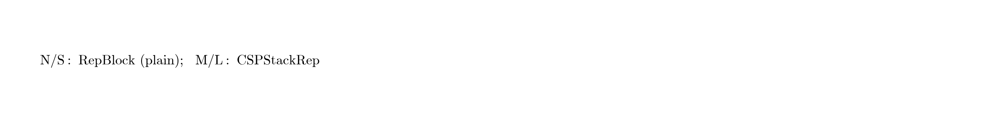

# YOLOv6：面向工业应用的单阶段目标检测器（中文译本）

> 原文：*YOLOv6: A Single-Stage Object Detection Framework for Industrial Applications*  
> 作者：Chuyi Li, Lulu Li, Hongliang Jiang, Kaiheng Weng, Yifei Geng, Liang Li, Zaidan Ke, Qingyuan Li, Meng Cheng, Weiqiang Nie, Yiduo Li, Bo Zhang, Yufei Liang, Linyuan Zhou, Xiaoming Xu, Xiangxiang Chu, Xiaoming Wei, Xiaolin Wei（美团视觉智能部）  
> 来源：[arXiv:2209.02976](https://arxiv.org/abs/2209.02976)（2022）  
> 说明：本文为论文式中文整理译本；公式以图片形式嵌入，便于阅读。

---

## 摘要

YOLO 系列因速度与精度的出色折中，常用于实时应用。本文推出 **YOLOv6**，专为工业部署而设计。网络设计上，引入 **RepVGG** 风格重参数化骨干、更高效的 **解耦头**，以及更先进的量化策略。训练策略上，引入自蒸馏等技术进一步提升性能，并系统分析训练策略对量化的影响。在 COCO 上，**YOLOv6-N** 达到 **35.9% AP**，T4 上 TensorRT FP16 可达 **1234 FPS**；**YOLOv6-S** 达到 **43.5% AP / 495 FPS**；**YOLOv6-M / L** 达到 **49.5% / 52.3% AP**，并在相近速度下超过其他同规模检测器。同时给出量化友好设计与量化后性能：**YOLOv6-S** 量化后约 **43.3% AP**，T4 上约 **869 FPS**。

---

## 1. 引言

YOLO 系列凭借速度与精度的平衡，在工业界广泛使用。从 YOLOv1 起，YOLO 走单阶段路线，把检测看作回归问题；YOLOv2、v3、v4、Scaled-YOLOv4、YOLOv5、YOLOX、PP-YOLOv2、YOLOv7 等持续改进结构与训练策略。

工业落地时，除精度外还必须考虑：

1. **速度与精度折中**（硬件上的实际吞吐）  
2. **部署友好**（是否易量化、易重参数化、推理路径是否干净）

作者认为许多近期检测器仍偏重精度，对部署特性关注不足。为此提出 **YOLOv6**，并同时开源训练代码与 ONNX/TensorRT 部署路径。

**主要贡献：**

1. 重新设计骨干与颈部，引入 **RepVGG** 风格结构。  
2. 分析重参数化与量化的交叉影响，设计 **RepOptimizer** 与 **通道级蒸馏** 等量化友好方案。  
3. 引入更多 **BagF / BoS**（训练与推理技巧），并系统调参以适配工业场景。  
4. 在 COCO 上取得当时很强的速度—精度表现。

---

## 2. 方法

### 2.1 网络设计

整体仍是 **Backbone + Neck + Head**。

  

#### 骨干网络

- **小模型（N/T/S）**：采用类似 RepVGG 的 **RepBlock**（训练多分支、推理融合为 3×3）。  
- **中大模型（M/L）**：改用 **CSPStackRep Block**（CSP + 堆叠 Rep），在精度与延迟之间更稳。

设计动机：RepVGG 风格在 GPU 上高效，但盲目加深/加宽会导致参数与计算浪费；因此按规模选用不同块。

#### 颈部（Neck）

采用基于重参数化的 **Rep-PAN**：在 PAN 拓扑上把普通卷积块换成 Rep 风格块，增强多尺度融合，同时保持部署友好。

#### 检测头

采用 **Efficient Decoupled Head**：

- 分类与回归解耦；  
- 相对 YOLOX 的解耦头进一步精简（减少中间层与宽度），在几乎不掉点的前提下降低延迟。

同时采用 **anchor-free**（类似 YOLOX/FCOS 的点式预测），简化设计并利于泛化。

### 2.2 标签分配

采用 **TAL（Task Alignment Learning）** 风格分配：让分类与定位任务更对齐，避免简单 IoU 或中心先验带来的错配。相对 SimOTA 等，作者报告 TAL 在 YOLOv6 上更稳、更好部署训练流程。

### 2.3 损失函数

#### 分类损失

采用 **Variational Focal Loss（VFL）**：对正负样本与质量感知做更好平衡，利于密集预测头。

#### 回归损失

- 小模型常用 **SIoU**；  
- 其他配置常用 **GIoU**；  
- 中大模型进一步引入 **DFL（Distribution Focal Loss）**，把框回归建模为分布，细化定位。

### 2.4 工业友好增强

#### 自蒸馏

对中大模型引入自蒸馏：学生既学标签，也学教师（可为本网络 EMA/更深配置）输出：

  

分类与回归分支分别做 KL 蒸馏，提升小目标与边界质量。

#### 训练策略与数据增强

沿用并系统调参 mosaic、mixup、余弦学习率、EMA、预训练等。强调：**增强强度要与模型容量匹配**，否则小模型易欠拟合或过增强。

### 2.5 量化与重参数化

工业部署常需 INT8。作者指出：

- 朴素 PTQ 对重参数化网络不友好；  
- 需结合 **RepOptimizer**、敏感层分析、以及 **通道级蒸馏** 做 QAT/PTQ 优化。

最终给出 FP16 与 INT8 的系统结果，证明 YOLOv6 在量化后仍可保持高吞吐。

### 2.6 模型缩放

对宽度/深度进行复合缩放，得到 N/T/S/M/L 系列：

  

---

## 3. 实验（摘要）

### 3.1 设置

- 数据集：COCO 2017  
- 输入：常见 640（部分更大分辨率配置另报）  
- 推理：TensorRT、T4 GPU，报告 FP16 / INT8

### 3.2 主结果（论文报告量级）

| 模型 | AP (val) | 速度（T4 TRT FP16） |
|------|----------|---------------------|
| YOLOv6-N | 35.9% | ~1234 FPS |
| YOLOv6-S | 43.5% | ~495 FPS |
| YOLOv6-M | 49.5% | （显著快于同 AP 竞品） |
| YOLOv6-L | 52.3% | （同规模 SorA） |

量化后：**YOLOv6-S ≈ 43.3% AP @ ~869 FPS（T4）**。

与 YOLOv5 / YOLOX / PPYOLOE / YOLOv7 等对比时，YOLOv6 在“工业可部署速度”维度表现突出。

### 3.3 消融（结论性）

1. Rep 骨干 + Rep-PAN 提升速度—精度。  
2. 高效解耦头降低延迟、几乎不损 AP。  
3. TAL + VFL +（SIoU/GIoU/DFL）组合优于旧标签/损失。  
4. 自蒸馏对 M/L 有稳定收益。  
5. 量化友好训练可明显减小 INT8 掉点。

---

## 4. 结论

YOLOv6 面向真实工业部署，把 **重参数化网络、高效解耦头、anchor-free、先进标签与损失、自蒸馏与量化** 整合进单一框架，在 COCO 上取得当时领先的实用折中，并强调“能跑分”与“能上线”之间的差距。

---

## 译本说明

- 公式与关键结果以论文表述为准；具体超参见官方仓库 [meituan/YOLOv6](https://github.com/meituan/YOLOv6)。  
- 后续 YOLOv6.1/6.2 等迭代不在本译本展开。
