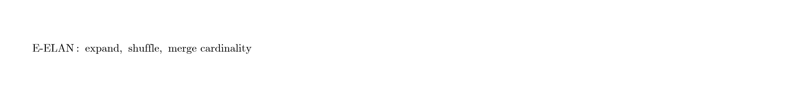
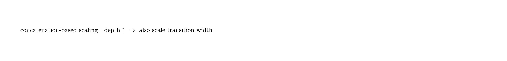
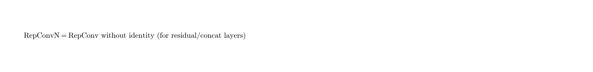

# YOLOv7：可训练的 Bag-of-Freebies 刷新实时检测 SOTA（中文译本）

> 原文：*YOLOv7: Trainable bag-of-freebies sets new state-of-the-art for real-time object detectors*  
> 作者：Chien-Yao Wang, Alexey Bochkovskiy, Hong-Yuan Mark Liao（台湾中研院资讯所）  
> 来源：[arXiv:2207.02696](https://arxiv.org/abs/2207.02696)（2022）  
> 代码：https://github.com/WongKinYiu/yolov7  
> 说明：本文为论文式中文整理译本；公式以图片形式嵌入，便于阅读。

---

## 摘要

YOLOv7 在约 **5–160 FPS** 区间内同时刷新速度与精度；在 V100 上 ≥30 FPS 的实时检测器中，最高达到 **56.8% AP**。例如 **YOLOv7-E6**（V100 约 56 FPS，55.9% AP）相对 Swin-L Cascade Mask R-CNN、ConvNeXt-XL Cascade Mask R-CNN 等大模型，速度高出数倍且精度更高。相对 YOLOR、YOLOX、Scaled-YOLOv4、YOLOv5、DETR 系等亦全面占优。作者强调：**仅在 MS COCO 上从零训练**，不使用额外数据或预训练权重。

---

## 1. 引言

实时检测是多目标跟踪、自动驾驶、机器人、医学影像等系统的基础模块，部署设备涵盖移动 CPU/GPU 与各类 NPU。近年实时检测器可粗分为：

- 面向边缘 CPU：MCUNet、NanoDet 等（MobileNet / ShuffleNet / GhostNet 思路）  
- 面向 GPU：YOLOX、YOLOR 等（ResNet / Darknet / DLA + CSP 优化）

本文除架构外，更关注 **训练过程优化**：在**不增加推理成本**的前提下，用可训练模块与策略提升精度，称为 **trainable bag-of-freebies**。

同时，重参数化与动态标签分配带来新问题：

1. 重参数化模块如何替换原模块才不破坏梯度路径？  
2. 多输出层（含辅助头）时，动态软标签如何分配？

作者提出 **planned re-parameterized model** 与 **coarse-to-fine lead-guided label assignment**，并给出面向 concat 架构的 **compound scaling**。

**贡献摘要：**

1. 多组 trainable bag-of-freebies，推理成本不变、精度明显提升。  
2. 针对重参数化替换与多头动态分配提出具体解法。  
3. 提出面向实时检测的 **extend** 与 **compound scaling**。  
4. 相对当时 SOTA 实时检测器，约减少 **40% 参数、50% 计算**，同时更快、更准。

---

## 2. 相关工作（摘要）

实时检测器通常需要：更强骨干、更好特征融合、更准检测范式、更稳损失、更好标签分配、更高效训练。本文不依赖额外数据的自监督/大模型蒸馏，而专注由 SOTA 方法衍生出的训练侧问题。

重参数化可分为模型级（多模型/多 checkpoint 权重平均）与模块级（训练多分支、推理融合）。并非所有重参数化模块都能直接套到任意架构；需按梯度路径设计。

模型缩放常用分辨率、深度、宽度、stage 数；NAS 可自动搜缩放因子。对 **PlainNet / ResNet**，入度出度稳定，可独立分析各因子；但对 **concatenation 架构**，深度缩放会改变 concat 后过渡层的通道比，必须联合考虑。

---

## 3. 架构

### 3.1 扩展高效层聚合网络（E-ELAN）

在 ELAN 基础上提出 **E-ELAN（Extended ELAN）**：

- 保持 ELAN 的梯度路径设计；  
- 用 **expand → shuffle → merge cardinality** 增强特征学习能力，而不破坏原有梯度通路；  
- 各计算块仍按设计学习更丰富的特征，再由 shuffle/merge 做组级特征融合。

  

直觉：不是盲目加深，而是在稳定梯度流的前提下扩大“基数（cardinality）”，提高参数利用率。

### 3.2 面向 Concat 模型的复合缩放

对 concat 架构：

- 仅加深计算块 → concat 后过渡层入通道变化 → 硬件利用率可能下降；  
- 因此缩放深度时，必须同步按相同变化量缩放过渡层宽度，以保持初始设计比例。

  

此外还有 **extend** 策略：在缩放家族中扩展深度/宽度，得到 W6/E6/D6/E6E 等更大模型。

---

## 4. 可训练的 Bag-of-Freebies

### 4.1 Planned re-parameterized convolution

RepConv 在 VGG 风格 PlainNet 上出色，但直接替换 ResNet / DenseNet 中的层往往会掉点。作者用梯度传播路径分析后发现：

- RepConv 含 `3×3`、`1×1` 与 **identity**；  
- 在已有 residual / concatenation 的层上再加 identity，会破坏多样梯度；  
- 因此对 residual/concat 层应使用 **无 identity 的 RepConvN**。

  

这就是 **planned re-parameterization**：按层类型有计划地决定能否带 identity。

### 4.2 粗到细的 Lead 引导标签分配

深度监督：在中间层加 **auxiliary head**，最终输出为 **lead head**。

动态软标签时代的新问题：**辅助头与 lead 头应如何分配标签？**

常见做法是两头各自用自己的预测做 assigner。YOLOv7 提出：

1. **Lead guided**：仅用 lead 预测 + GT 生成软标签，同时监督 auxiliary 与 lead；  
2. **Coarse-to-fine lead guided**：生成粗标签给 auxiliary、细标签给 lead。

动机：lead 更强，其软标签更能代表数据—目标分布；让浅层 auxiliary 先学 lead 已学到的信息，lead 更专注残差信息（广义残差学习视角）。

---

## 5. 其他训练细节（论文侧重点）

- 强调 **从零训练 COCO**，不依赖 ImageNet 预训练。  
- 结合 YOLOR 式隐式知识、模型 EMA、数据增强等工程 BoF。  
- 推理路径保持干净：辅助头与重参数化多分支在部署时不增加成本。

---

## 6. 实验（摘要）

### 6.1 与基线对比（640，论文 Table 1 量级）

| 模型 | 参数 | FLOPs | APval |
|------|------|-------|------------------|
| YOLOR-CSP | 52.9M | 120.4G | 50.8% |
| **YOLOv7** | **36.9M** | **104.7G** | **51.2%** |
| YOLOR-CSP-X | 96.9M | 226.8G | 52.7% |
| **YOLOv7-X** | **71.3M** | **189.9G** | **52.9%** |
| YOLOv4-tiny | 6.1M | 6.9G | 24.9% |
| **YOLOv7-tiny** | **6.2M** | **5.8G** | **35.2%** |

相对 YOLOR-CSP：约 **-43% 参数、-15% 计算，+0.4 AP**。

### 6.2 实时对比（V100，论文报告）

| 模型 | 尺寸 | FPS (V100) | APtest / APval |
|------|------|------------|--------------------------------------|
| YOLOv7-tiny-SiLU | 640 | 286 | 38.7% / 38.7% |
| YOLOv7 | 640 | 161 | 51.4% / 51.2% |
| YOLOv7-X | 640 | 114 | 53.1% / 52.9% |
| YOLOv7-W6 | 1280 | 84 | 54.9% / 54.6% |
| YOLOv7-E6 | 1280 | 56 | 56.0% / 55.9% |
| YOLOv7-D6 | 1280 | 44 | 56.6% / 56.3% |
| **YOLOv7-E6E** | 1280 | 36 | **56.8% / 56.8%** |

在 5–160 FPS 区间全面领先当时公开的实时检测器；≥30 FPS 实时档最高约 **56.8% AP**。

### 6.3 消融结论

1. E-ELAN 优于简单加深/加宽。  
2. Concat 复合缩放优于独立缩放深度。  
3. RepConvN（planned）在 residual/concat 上优于直接套 RepConv。  
4. Lead 引导 / coarse-to-fine 分配优于两头独立 assign。

---

## 7. 结论

YOLOv7 把重点从“只改推理结构”转向 **trainable bag-of-freebies**：用 E-ELAN、concat 复合缩放、planned RepConvN、coarse-to-fine lead 引导分配，在不增加推理成本的前提下刷新实时检测 SOTA，并坚持 COCO 从零训练的公平设定。

---

## 译本说明

- 数字以 arXiv:2207.02696 正文表格为准；不同评测精度（FP16/FP32、NMS IoU）会有小幅波动。  
- 附录中的 coarse-to-fine 约束细节可参考原论文 Appendix。
