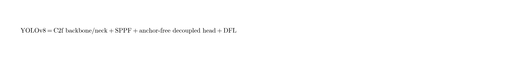
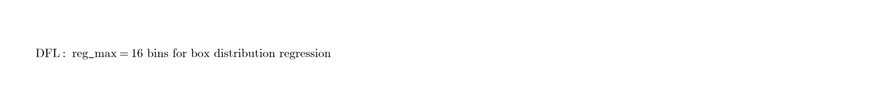

# YOLOv8：中文译本（基于官方实现与架构说明）

**状态说明（重要）：**  
YOLOv8 **没有**由 Ultralytics 发布的正式同行评审论文。官方明确表示因模型迭代快，以文档与代码为准，而非静态论文：

- 代码：https://github.com/ultralytics/ultralytics  
- 文档：https://docs.ultralytics.com/models/yolov8/  
- 架构指南：https://docs.ultralytics.com/guides/yolo-architecture/  
- 发布：Ultralytics（Glenn Jocher, Ayush Chaurasia, Jing Qiu 等），**2023-01-10**

> 本译本依据官方文档、仓库配置与社区梳理整理，属于**工程实现导向的技术译本**，不是某篇单一论文的逐句翻译。公式图见 `figures/yolov8/`。

---

## 1. 概述

YOLOv8 是 Ultralytics 在 YOLOv5 工程体系上的下一代实时视觉框架，目标是在保持易用性（训练 / 验证 / 推理 / 导出一体化）的同时，升级骨干、颈部与检测头，并**原生支持多任务**：

- 目标检测（Detect）  
- 实例分割（Segment）  
- 姿态 / 关键点（Pose）  
- 旋转框检测（OBB）  
- 图像分类（Classify）

相对经典 YOLOv5，结构上最醒目的变化是：

1. **C2f** 替换 **C3**  
2. **Anchor-free + 解耦头**  
3. **DFL（Distribution Focal Loss）** 框回归（`reg_max=16`）

---

## 2. 总体架构

<p align="center">
  
</p>

仍遵循 **Backbone → Neck → Head**：

### 2.1 Backbone（骨干）

- 以 CSP 风格堆叠为主，核心块从 YOLOv5 的 **C3** 换为 **C2f**（CSP Bottleneck with 2 convolutions, faster）。  
- **C2f** 思路：通道拆分后，经一系列 bottleneck，并把**中间特征一并 concat** 再投影，增强梯度流与特征复用，同时控制算力。  
- 末端保留 **SPPF**（串行 `k=5` 池化近似多尺度 SPP）。

### 2.2 Neck（颈部）

- 延续 **FPN + PAN** 式多尺度融合。  
- 融合模块同样多用 **C2f**，与骨干风格统一。  
- 输出多尺度特征图（通常 P3/P4/P5，对应小/中/大目标）。

### 2.3 Head（检测头）

**Anchor-free Split Ultralytics Head：**

- **解耦**：分类与回归分支分离（相对 YOLOv5 耦合头更清晰）。  
- **无锚框**：在网格点上直接预测框，不再依赖数据集聚类出的 anchor。  
- **DFL 回归**：每个框坐标不直接回归标量，而是对 `reg_max=16` 个离散 bin 做分布预测，再取期望得到连续坐标。

<p align="center">
  
</p>

好处：去掉手工锚框调参；框更细；NMS 前候选相对更干净，训练与自定义数据更稳。

---

## 3. 相对 YOLOv5 的关键差异

| 项目 | YOLOv5（经典） | YOLOv8 |
|------|----------------|--------|
| 骨干块 | C3 | **C2f** |
| 空间池化 | SPPF | SPPF（保留） |
| 检测头 | 多为 anchor-based 耦合头 | **anchor-free 解耦头** |
| 框回归 | 直接回归 / IoU 系损失 | **DFL + IoU 系损失** |
| 任务覆盖 | 检测为主，分割等后补 | **detect/seg/pose/obb/cls 原生** |
| 工程包 | `ultralytics/yolov5` | 统一包 `ultralytics` |

（注：YOLOv5 后期也有 anchor-free 的 `u` 变体配置；经典主线仍以 anchor-based 为主。）

---

## 4. 模型缩放与性能（COCO Detect）

家族缩放：**n / s / m / l / x**（宽度与深度复合缩放）。官方文档报告（640，COCO val）：

| 模型 | mAP<sup>val</sup> 50-95 | CPU ONNX (ms) | A100 TensorRT (ms) | 参数 (M) | FLOPs (B) |
|------|-------------------------|---------------|--------------------|----------|-----------|
| YOLOv8n | 37.3 | 80.4 | 0.99 | 3.2 | 8.7 |
| YOLOv8s | 44.9 | 128.4 | 1.20 | 11.2 | 28.6 |
| YOLOv8m | 50.2 | 234.7 | 1.83 | 25.9 | 78.9 |
| YOLOv8l | 52.9 | 375.2 | 2.39 | 43.7 | 165.2 |
| YOLOv8x | 53.9 | 479.1 | 3.53 | 68.2 | 257.8 |

速度数字依赖硬件与导出后端，引用时请对照官方最新文档。

---

## 5. 多任务变体

| 任务 | 权重命名示例 | 说明 |
|------|--------------|------|
| Detect | `yolov8n.pt` … `yolov8x.pt` | 标准框检测 |
| Segment | `yolov8n-seg.pt` … | 检测 + 实例掩码 |
| Pose | `yolov8n-pose.pt` … | 检测 + 关键点 |
| OBB | `yolov8n-obb.pt` … | 旋转框 |
| Classify | `yolov8n-cls.pt` … | 整图分类 |

各变体共享同一套训练 / 验证 / 推理 / 导出模式接口。

---

## 6. 训练与工程要点

1. **API 统一**：`from ultralytics import YOLO`，一条链路完成 train / val / predict / export。  
2. **强增广**：延续 mosaic 等；具体超参随规模与任务调整。  
3. **损失组合**：分类损失 + IoU 系框损失 + **DFL**；分割/姿态等任务再加对应分支损失。  
4. **导出友好**：ONNX、TensorRT、CoreML、OpenVINO 等一等公民支持。  
5. **许可证**：AGPL-3.0 / Enterprise；商用需注意协议。

最小示例：

```python
from ultralytics import YOLO

model = YOLO("yolov8n.pt")
model.train(data="coco8.yaml", epochs=100, imgsz=640)
results = model("path/to/bus.jpg")
```

---

## 7. 在 YOLO 演进中的位置

- **相对 v5**：工程壳更统一，结构上完成 anchor-free + C2f + DFL 的主流化。  
- **相对 v6/v7**：v6 偏工业重参数化与量化，v7 偏 trainable BoF 与 E-ELAN；v8 偏 Ultralytics 生态的多任务产品化与可维护架构。  
- **后续**：YOLO11 / YOLO26 等继续换块（如 C3k2、C2PSA）并探索 NMS-free / 去 DFL 等方向；精读后续版本时可把 v8 当作“现代 Ultralytics 基线”。

---

## 8. 引用（官方建议）

```bibtex
@software{yolov8_ultralytics,
  author = {Glenn Jocher and Ayush Chaurasia and Jing Qiu},
  title = {Ultralytics YOLOv8},
  version = {8.0.0},
  year = {2023},
  url = {https://github.com/ultralytics/ultralytics},
  license = {AGPL-3.0}
}
```

---

## 译本说明

- 无正式论文，数字与模块名以 Ultralytics 文档 / `ultralytics/cfg/models` 为准。  
- 公式图为便于阅读的示意整理，非官方论文插图。
