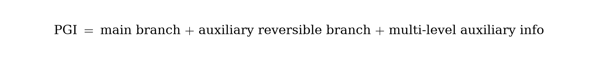

# YOLOv9：用可编程梯度信息学习你想学的内容（中文译本）

> 原文：*YOLOv9: Learning What You Want to Learn Using Programmable Gradient Information*  
> 作者：Chien-Yao Wang, I-Hau Yeh, Hong-Yuan Mark Liao（中研院等）  
> 来源：[arXiv:2402.13616](https://arxiv.org/abs/2402.13616)（2024）  
> 代码：https://github.com/WongKinYiu/yolov9  
> 说明：论文式中文整理译本；公式以图片嵌入。

---

## 摘要

深度网络前向时会大量丢失输入信息（信息瓶颈），导致目标函数只能在残缺特征上算梯度，关联错误、收敛变差。本文提出 **可编程梯度信息（PGI）**：用辅助可逆分支提供完整输入信息来算目标，从而得到可靠梯度更新主分支；推理时只走主分支，无额外成本。同时提出基于梯度路径规划的轻量骨干 **GELAN（Generalized ELAN）**。在 COCO 上，GELAN 仅用常规卷积即可超过许多深度可分离卷积设计的参数利用率；结合 PGI 的 YOLOv9 从零训练即可超过不少大数据预训练检测器。

---

## 1. 引言

过去工作多关注架构（CNN / Transformer / Mamba）与目标（损失、标签分配、辅助监督），却忽视前向过程中的信息损失。信息瓶颈会使浅层尚存的关键信息到深层后不足，梯度不可靠。

常见缓解：

1. **可逆架构**：显式保留输入，但推理成本高、难建高层语义；  
2. **掩码建模**：重建损失可能与检测目标冲突；  
3. **深度监督**：浅层监督易误差累积，且对小模型不友好。

**PGI** 用辅助可逆分支编程多语义级梯度传播；**GELAN** 兼顾参数、算力、精度与速度，允许按设备替换计算块。二者结合即 **YOLOv9**。

**贡献：**

1. 从可逆函数视角解释信息瓶颈，并设计 PGI。  
2. 使辅助监督不再只适用于极深网络，轻量模型也能受益。  
3. GELAN 常规卷积参数利用率优于先进 DWConv 设计。  
4. COCO 上全面刷新当时实时检测从零训练表现。

---

## 2. 问题陈述

### 2.1 信息瓶颈

  

层数加深后，原始信息更易丢失；而参数更新却依赖“已残缺”的输出与目标算损失 → 梯度不可靠。

### 2.2 可逆函数

  

ResNet 式残差显式传递信息，利于极深收敛，但浅层时未必优于普通 ResNet。掩码/扩散/VAE 等近似求逆，在欠参数化轻量模型上又易丢掉映射目标所需的关键互信息 \(I(Y,X)\)。

结论：轻量模型目标不是完整保留 \(X\)，而是**准确筛选 \(I(Y,X)\)**，并提供可靠梯度。

---

## 3. 方法

### 3.1 PGI（Programmable Gradient Information）

  

三部分：

1. **Main branch**：推理路径，无额外开销。  
2. **Auxiliary reversible branch**：训练期提供可靠梯度，缓解加深带来的信息瓶颈。  
3. **Multi-level auxiliary information**：把多语义级信息可编程地回灌主分支，减轻传统深度监督的误差累积（尤其多预测分支与轻量模型）。

相对 RevCol 等在推理期加连接的方案，PGI 把“可逆”放在辅助分支，避免 20%～2× 推理变慢。

### 3.2 GELAN

  

在 ELAN / CSP 梯度路径规划上泛化：用户可按设备选择 Conv / Res / Dark / CSP 等计算块，在参数、FLOPs、精度、延迟间折中。实验表明 CSP 风格块在 GELAN-S 上表现突出。

YOLOv9 以 YOLOv7 为基，用 GELAN 改结构、用 PGI 改训练。

---

## 4. 实验（摘要）

COCO val，从零训练（论文表格量级）：

| 模型 | 参数 | FLOPs | APval |
|------|------|-------|------------------|
| YOLOv9-S | 7.1M | 26.4G | 46.8% |
| YOLOv9-M | 20.0M | 76.3G | 51.4% |
| YOLOv9-C | 25.3M | 102.1G | 53.0% |
| YOLOv9-E | 57.3M | 189.0G | **55.6%** |

相对 YOLOv7-AF：YOLOv9-C 约 **-42% 参数、-22% 计算**，AP 持平约 53%。相对 YOLOv8-X：YOLOv9-E 更少参数/算力，约 **+1.7 AP**。

消融：PGI 对 S/M/C/E 均有收益；对小模型相对朴素深度监督更稳。

---

## 5. 结论

YOLOv9 从“信息如何在深层中存活并产生可靠梯度”切入，用 **PGI + GELAN** 同时改进训练与架构，在不增加推理成本的前提下刷新实时检测从零训练 SOTA。

---

## 译本说明

数字以 arXiv:2402.13616 为准；Ultralytics 生态亦集成 YOLOv9 权重，细节以原仓库为准。
